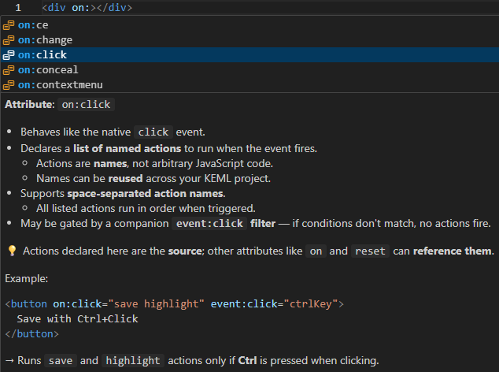
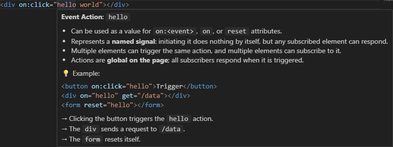
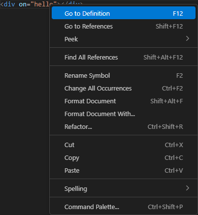
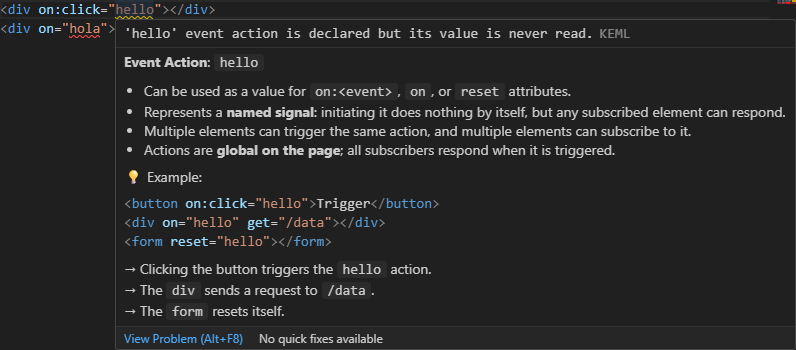
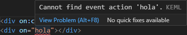

# KEML for VSCode


[](https://thealjey.github.io/keml/)

Enhance your HTML with
**[KEML](https://thealjey.github.io/keml/) support in VSCode** —
get intelligent autocompletion, hover tooltips, Go to Definition/References,
and diagnostics for KEML attributes.

---

## Table of Contents

- [Features](#features)
- [Visuals](#visuals)
- [Installation](#installation)
- [Configuration](#configuration)
- [FAQs](#faqs)
- [License & Changelog](#license--changelog)

---

## Features

- **Autocomplete**  
  Suggests valid KEML attributes and their values as you type.
- **Hover tooltips**  
  Hover over an attribute or value to see its description and usage examples.
- **Go to Definition / References**

  - Jump directly to where an action is defined and/or used.
  - Navigate across your codebase to trace how actions are triggered and
    handled.

- **Diagnostics**  
  Inline error and warning reporting for invalid usage:

  - Flags attributes that do not work because another required attribute is
    missing.
  - Highlights unused actions, so you know which ones are safe to remove.
  - Detects undefined actions, preventing accidental subscriptions to
    non-existent actions.
  - Validates attributes and values, catching incorrect or out-of-context usage.

- **Smooth workflow integration**  
  Works out of the box with HTML and can be enabled for any file containing
  HTML-like syntax via the `keml.languageIds` setting.

---

## Visuals

Here’s how KEML support looks in VSCode:

### Autocomplete

Typing an `on:` attribute triggers context-aware suggestions:

- Suggestions include attributes applicable to this element and attribute
  configuration, as well as any actions found in your project.
- Pressing `Enter` or `Tab` inserts the selected attribute.



### Hover Tooltips

Hovering over an action shows its description and usage:

- Hovering over `hello` displays a short description and usage examples.



### Go to Definition / References

Right-click an action (or `Ctrl+LMB` / `Cmd+LMB`) to navigate:

- Jump directly to where `hello` is defined.



### Diagnostics

Inline diagnostics highlight unused or undefined actions:

- `hello` is underlined with the severity configured in
  `keml.actionUnusedSeverity`.



- `hola` is underlined with the severity configured in
  `keml.actionUndefinedSeverity`.



---

## Installation

1. Open VSCode → Extensions (`Ctrl+Shift+X` / `Cmd+Shift+X`).
2. Search **`KEML`** and click **Install**.
3. Reload VSCode if prompted.

---

## Configuration

The extension provides a few workspace settings to customize diagnostics and
file scanning behavior.

### Action Diagnostics

- **`keml.actionUndefinedSeverity`** (default: `Error`)  
  Controls how **undefined actions** are reported in the workspace.  
  Choose **Disable** to ignore undefined actions entirely.  
  **Options:** `Error`, `Warning`, `Information`, `Hint`, `Disable`

- **`keml.actionUnusedSeverity`** (default: `Warning`)  
  Controls how **unused actions** are reported in the workspace.  
  Choose **Disable** to ignore unused actions entirely.  
  **Options:** `Error`, `Warning`, `Information`, `Hint`, `Disable`

> These settings help keep your action definitions clean and consistent by
> highlighting potential issues directly in the editor.

### File Scanning

- **`keml.languageIds`** (default: `["html"]`)  
  List of
  [language identifiers](https://code.visualstudio.com/docs/languages/identifiers)
  where the extension is **active**.  
  Files with these languages are parsed as HTML to collect metadata.  
  If your files are not strictly HTML, they must still be HTML-like enough to be
  parsed successfully.  
  **Example:**

  ```json
  ["html", "php", "vue"]
  ```

- **`keml.include`** (default: `[]`)  
  [Glob patterns](https://code.visualstudio.com/docs/editor/codebasics#_advanced-search-options)
  to **include additional files** when scanning for metadata, even if normally
  excluded by the builtin VSCode `search.exclude` setting.  
  By default, all matches for `keml.languageIds` are scanned.  
  **Example:**

  ```json
  ["**/templates/**", "**/build/**"]
  ```

---

## FAQs

**Q: Does the extension include the KEML runtime?**  
A: No.  
This extension provides editor tooling only.
Install the runtime via CDN or `npm install keml`.

**Q: Will this work with React/Vue/Svelte?**  
A: Yes.  
KEML itself does not interfere with any frameworks, nor can be confused by
them; and the extension can work with any files that contain at least some
parts that look like HTML tags (provided that you configure the
`keml.languageIds` setting correctly).

---

## License & Changelog

MIT — see [LICENSE](LICENSE).  
Release notes: [CHANGELOG.md](CHANGELOG.md).
